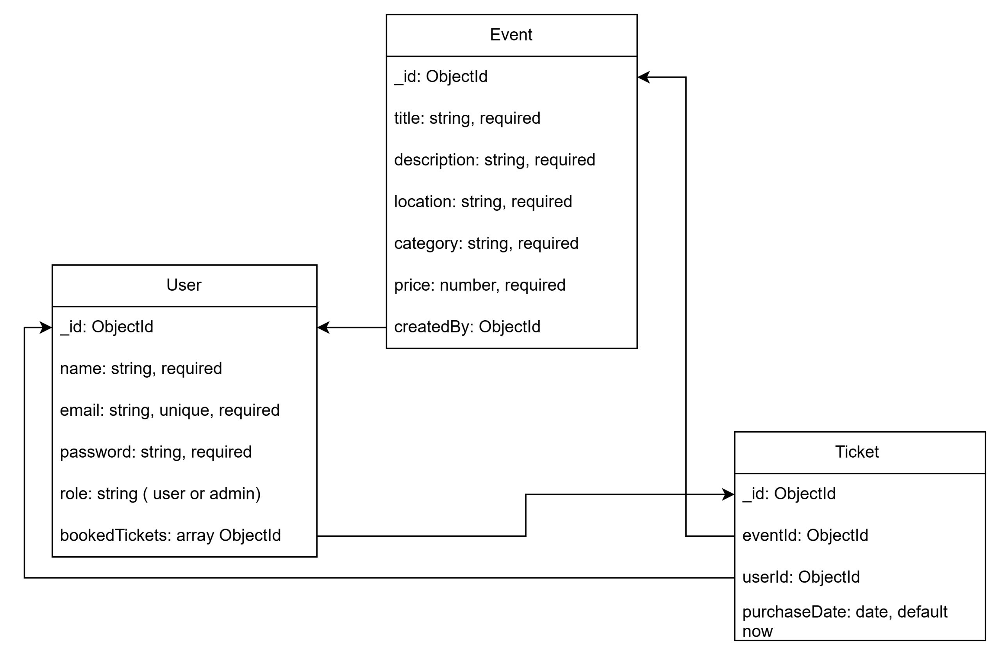

# Nền tảng quản lý sự kiện

Đây là một ứng dụng web cho phép người dùng đăng ký, tìm kiếm, và đặt vé cho các sự kiện như hội thảo, hòa nhạc. Admin có thể tạo, chỉnh sửa sự kiện và xem thống kê vé. Hệ thống gửi thông báo thời gian thực khi có sự kiện mới. Backend được xây dựng bằng Node.js, Express, và MongoDB, tích hợp Socket.IO.

## Tính năng chính
- Đăng ký/đăng nhập và phân quyền (user/admin).
- Tạo, chỉnh sửa, xóa, tìm kiếm sự kiện.
- Đặt vé và xem lịch sử vé.
- Thông báo thời gian thực khi có sự kiện mới.
- Thống kê tổng số sự kiện và vé (cho admin).

## Công nghệ
- Backend: Node.js, Express.js, MongoDB, Socket.IO
- Authentication: JWT
- Triển khai: Heroku (dự kiến)

## Cơ sở dữ liệu
Sử dụng MongoDB với 3 collection:
- **User**: Lưu thông tin người dùng (name, email, password, role, bookedTickets).
- **Event**: Lưu thông tin sự kiện (title, description, date, location, category, price, createdBy).
- **Ticket**: Lưu thông tin vé (eventId, userId, purchaseDate).

## API Endpoints
(Sẽ được cập nhật sau khi hoàn thành danh sách)